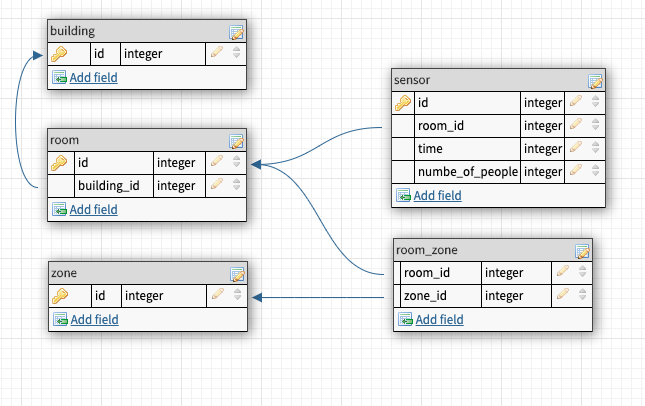

# VergeSense Code Challenge

## Created by Dion Roloff as app submission to VergeSense startup.

## Technologies Used

This project was written using JavaScript's React framework, Chart.js, and Ant Design UI.

## ERD

## Available Scripts

In the project directory, you can run:

### `npm start`

Runs the app in the development mode. 
Open [http://localhost:3000](http://localhost:3000) to view it in the browser.

The entire app is a single page. The user selects a start and end date with two day and time pickers, then after clicking the "Show Graph" button the data will render on the graph if there are sensor reports which occured between those two points in time. The user can select and deselect individual sensors to make the focus on particular sensors and scale the graph. The y axis represents the number of people a sensor reports at a time point, and the x axis represents time.

